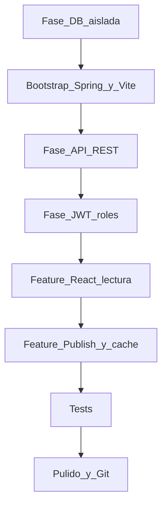
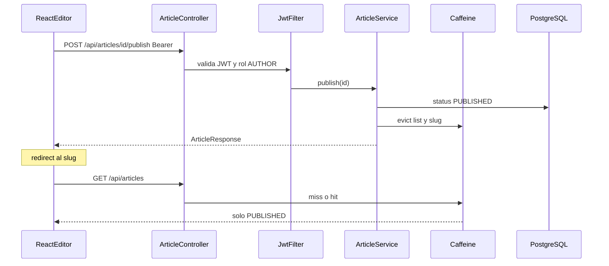

# Guía de aprendizaje: Atlas (Java 17, Spring Boot 3)

Este documento es un **plan de estudio e implementación para ti**. El agente no genera el código.

Spring Boot 13 no existe. Stack cerrado: **Java 17 + Spring Boot 3.x** (3.4 o 3.5), Maven, PostgreSQL 16, React + TypeScript + Vite.

Referencias largas (no las necesitas para arrancar): [Plan 10 Dias.md](../docs/Plan%2010%20Dias.md), [Plan de Proyecto Atlas.md](../docs/Plan%20de%20Proyecto%20Atlas.md), [Speed Run Atlas.md](../docs/Speed%20Run%20Atlas.md).

## Regla de trabajo

1. **Solo la base de datos** es aislada y va **primera** (SQL a mano, sin Spring).
2. Luego capas en el orden del Plan 10 Días: API completa → seguridad → React lectura → editor + caché.
3. Hasta que exista Auth, los endpoints quedan **públicos**. En la fase JWT los proteges por rol.
4. Cada fase cierra con un **checkpoint**. Si no arranca lo de ayer, eso es el día de hoy.
5. Una rama por fase. Commits `feat:` / `fix:`. No subas secretos.



Hasta React, el checkpoint es SQL o Swagger/Postman. Desde lectura, el checkpoint es el **navegador**.

Dentro de las features con UI:

```text
endpoints ya hechos  →  pantallas React  →  checkpoint en el navegador
```

## Qué vas a construir

Atlas: mini knowledge base (el mismo problema que Nova en la entrevista).

- Catálogo público de artículos (listado, detalle, solo `PUBLISHED`)
- Autores crean draft y publican
- Login / registro con JWT y roles `READER` / `AUTHOR`
- Caché Caffeine en listado y detalle, evict al publicar
- UI: home, detalle, login, editor

**Feature sagrada (la que narrarás):** login AUTHOR → crear draft → Publish → anónimo lo ve en el home.

**No entra en este plan:** comentarios, panel admin, Redis, Spring Cloud, GraphQL, Next.js, E2E Playwright, Testcontainers, deploy cloud. Eso es extra si el slice ya es demoable.

## Stack

- **DB:** PostgreSQL 16
- **API:** Java 17, Spring Boot 3.x, Maven, Spring Web, Validation, Data JPA, Security, Cache + Caffeine, Flyway, springdoc-openapi (Swagger)
- **Front:** Vite + React + TypeScript, React Router, fetch, CSS propio
- **Git:** ramas por fase; carpetas ya existentes: [`backend/`](../backend/), [`frontend/`](../frontend/)

---

## Fase 0 — Preparación

Instala: Git, JDK 17, Maven (o el wrapper que genere Initializr), Node.js 20+, PostgreSQL 16 (o Docker), IntelliJ o VS Code + Extension Pack for Java.

Comprueba:

```text
java -version          → 17
node -v                → 20+
docker --version       → si usas Compose para Postgres
```

Tablero (historias = capas que cierran el scorecard Konrad):

- Schema DB — Done cuando: tablas creadas y JOINs probados en SQL
- API REST — Done cuando: listado público, detalle por slug, crear draft, publish, en Swagger
- Auth — Done cuando: sin token 401, READER no publica 403, AUTHOR sí
- Lectura React — Done cuando: ves artículos seed en el browser
- Publish E2E — Done cuando: el flujo sagrado funciona y la caché se invalida
- Tests + pulido — Done cuando: 4 tests verdes, README y DEMO.md

**Checkpoint:** repo Git, README de 10 líneas, carpetas `backend/` y `frontend/` listas (hoy vacías a propósito).

---

## Fase 1 — Base de datos (única etapa aislada)

Sin Spring. Sin React. Solo SQL.

Aprendes: tablas, PK/FK, `UNIQUE`, índices, `JOIN`, por qué un draft no debe salir en un listado público.

### Modelo

```text
users
  id UUID PK, email UNIQUE, password_hash, display_name, role, created_at

categories
  id UUID PK, name, slug UNIQUE

articles
  id UUID PK, title, slug UNIQUE, body, status, author_id FK users,
  category_id FK categories, created_at, updated_at, published_at
```

`status`: `DRAFT` | `PUBLISHED`. Índices: `users(email)`, `articles(slug)`, `articles(status, published_at DESC)`.

La tabla `users` existe desde ya; el login lo implementas en la fase JWT. El `password_hash` puede ser un texto dummy en el seed (`not-a-real-hash`); BCrypt llega en la Fase 3.

Relaciones a poder explicar en voz alta:

- Un autor (`users`) tiene muchos artículos (1:N)
- Un artículo pertenece a una categoría (N:1)
- No borres una categoría si aún tiene artículos (`ON DELETE RESTRICT`)

### Qué haces tú

1. Diagrama ER en papel (tres cajas, dos flechas).
2. Levanta **solo** Postgres. Ejemplo Compose temporal (no es la app):

```yaml
services:
  postgres:
    image: postgres:16
    environment:
      POSTGRES_DB: atlas
      POSTGRES_USER: atlas
      POSTGRES_PASSWORD: atlas
    ports:
      - "5432:5432"
```

3. Escribe el SQL en `docs/schema.sql` (o `backend/src/main/resources/db/schema.sql` si ya creaste la carpeta): `CREATE TABLE`, FKs, índices. Tú escribes el SQL; Hibernate no lo inventa.
4. Ejecútalo (`psql`, DBeaver, o `docker exec -i ... psql < docs/schema.sql`).
5. Practica a mano:
   - `INSERT` de 1 user AUTHOR, 2 categorías, 1 artículo `PUBLISHED` y 1 `DRAFT`
   - `SELECT` + `JOIN` artículos ↔ autor ↔ categoría
   - `UPDATE` de un draft a `PUBLISHED` (y `published_at = now()`)
   - `DELETE` de un artículo de prueba

### Errores típicos

- Olvidar `UNIQUE` en `email` y `slug` (la API luego no puede devolver 409 de verdad).
- Índice solo en `slug` y no en `(status, published_at)` — el listado público filtra y ordena por esos dos.
- `uuid` sin extensión: en PostgreSQL 16 `gen_random_uuid()` basta; no hace falta `uuid-ossp` si usas esa función.

**Checkpoint:** un `SELECT` que liste **solo publicados** con `display_name` del autor y `name` de la categoría. Si el draft aparece, el `WHERE` está mal.

Rama: `feature/db`.

---

## Bootstrap mínimo (antes de la API)

Esqueleto vacío, una sola vez. Sin lógica de negocio.

### Qué haces tú

1. [Spring Initializr](https://start.spring.io/): Java 17, Spring Boot 3.x, Maven, jar, packaging en `backend/`. Dependencias: Spring Web, Validation, Data JPA, Security, Cache, Flyway. PostgreSQL driver. Luego añade a mano:
   - `springdoc-openapi-starter-webmvc-ui` (Swagger UI)
   - `caffeine` (la usas en la Fase 5; puedes añadirla entonces)
2. Copia el SQL de la Fase 1 a Flyway: `backend/src/main/resources/db/migration/V1__init.sql`. Hibernate `ddl-auto: validate` (Flyway es la fuente de verdad).
3. Seed de perfil `dev`: 1 AUTHOR (`author@atlas.dev` / password documentada en README), 2 categorías, 1 artículo published y 1 draft. `data.sql` o un `CommandLineRunner` con `@Profile("dev")`.
4. `GET /api/health` — un controller de una línea o Actuator `/actuator/health`.
5. CORS y Swagger (`/swagger-ui.html`). Security todavía **permitAll** (si Spring Security te bloquea el health con 401, abre todo en un `SecurityFilterChain` mínimo y lo cierras en la Fase 3).
6. `npm create vite@latest` en `frontend/` (React + TypeScript) → h1 “Atlas” + en `vite.config.ts` proxy `/api` → `http://localhost:8080`.
7. `docker-compose.yml` en la raíz: **solo** `postgres:16`. La API y Vite corren en tu máquina.

`application.yml` (tú lo escribes): datasource hacia el Compose, Flyway on, `spring.jpa.hibernate.ddl-auto: validate`, perfil `dev` para el seed.

### Errores típicos

- `ddl-auto: update` “para ir rápido”: no. El JD se gana explicando Flyway.
- Seed que corre en cada arranque y duplica slugs → 409 más adelante. Usa `IF NOT EXISTS` / `ON CONFLICT` o un runner que compruebe.
- Vite sin proxy: el browser llama a `:5173/api` y obtienes 404. El proxy evita CORS en dev hasta que configures el origin.

**Checkpoint:** tres procesos levantan (Postgres, API health 200, Vite). Flyway corre y ves las filas seed en Postgres. Swagger abre.

Rama: `feature/bootstrap`.

---

## Fase 2 — API REST (sin seguridad fina)

**Historia:** “Puedo listar, leer, crear draft y publicar artículos por HTTP.”
**Sin login.** Endpoints públicos. La Fase 3 los cierra.

Aprendes: capas Spring, DTO vs entidad, códigos HTTP, paginación, reglas en el service.

### Paquetes sugeridos (por capa)

```text
backend/src/main/java/.../
  controller/
  service/
  repository/
  domain/
  dto/
  config/
  exception/
```

### Backend — qué construyes

- Entidades JPA alineadas al SQL de Flyway (`UUID`, enums `Role` y `ArticleStatus`, FKs `ManyToOne` LAZY).
- Repositorios Spring Data. Para el detalle: `JOIN FETCH` o `@EntityGraph` (artículo + autor + categoría) — evitas el 500 de `LazyInitializationException` al mapear JSON.
- DTOs de entrada y salida distintos (`CreateArticleRequest` vs `ArticleResponse`). Nunca la entidad al JSON. Nunca `passwordHash`.
- `@RestController` → `@Service` → repository. El controller no hace SQL. `@Transactional` en el service.
- `@ControllerAdvice`: 400 validación, 404 no existe / draft en público, 409 slug duplicado.
- Bean Validation: `@NotBlank`, `@Size` en título y body.

Rutas:

- `GET /api/articles` — solo `PUBLISHED`, `page` / `size`, orden `published_at DESC`
- `GET /api/articles/{slug}` — 404 si draft o no existe
- `POST /api/articles` — crea `DRAFT` (slug único; si choca, 409)
- `POST /api/articles/{id}/publish` — pasa a `PUBLISHED`; body vacío o en blanco → 400, no publica
- `GET /api/categories` — listado del seed (sin CRUD admin)

Hasta que exista Auth, `author_id` del `POST` puede ser el usuario seed (constante de perfil `dev`). En la Fase 3 lo tomas del JWT.

Probar todo en Swagger.

### Errores típicos

- Devolver la entidad JPA: serializa el proxy, toca `author` fuera de la sesión, 500. DTOs desde el día uno.
- `POST /publish` idempotente a medias: publicar dos veces el mismo id no debe crear otro artículo; puede devolver 200 si ya estaba published.
- Listado sin filtro `status = PUBLISHED`: el draft seed se ve en público y rompes el checkpoint.

**Checkpoint:** 5 calls en Swagger/Postman. El draft **no** sale en el GET público. `GET` de su slug → 404. `POST publish` → el GET público lo incluye. 201 + header `Location` al crear, si puedes.

Rama: `feature/api`.

---

## Fase 3 — JWT y roles

**Historia:** “Anónimo lee publicados; AUTHOR crea y publica; READER no publica.”

Aprendes: authentication vs authorization, BCrypt vs “encriptar”, Bearer, CORS, 401 vs 403.

### Backend — qué construyes

- `POST /api/auth/register` — alta `READER`, password BCrypt, 201. Email duplicado → 409.
- `POST /api/auth/login` — responde `{ accessToken, tokenType, expiresIn, user }`. Password incorrecto → 401 (no 500).
- JWT en header `Authorization: Bearer …`. Claims: `sub` (email o user id) + `role`. Expiración corta (p. ej. 1 h). **Sin refresh token.**
- `SecurityFilterChain` (Spring Security 6, lambda DSL):
  - Público: `GET /api/articles/**`, `GET /api/categories`, `POST /api/auth/**`, Swagger, health
  - `POST /api/articles` y `POST /api/articles/*/publish` → rol `AUTHOR`
  - Stateless. CSRF off (SPA + Bearer); anótalo para poder explicarlo.
- CORS: origin `http://localhost:5173`, no `*`.
- El `author_id` al crear sale del usuario autenticado, no de un id en el body.

Matriz que debes poder recitar:

- Sin token + `POST /api/articles` → **401**
- `READER` + publish → **403**
- `AUTHOR` + publish → **200** y el GET público lo ve
- Anónimo + GET publicados → **200**

### Errores típicos

- 403 cuando debería ser 401 (hay token inválido vs no hay token).
- Meter el password en el JWT o en los logs.
- CORS mal: Postman funciona, el browser no (`Origin` + preflight `OPTIONS`).
- Perder 3 horas en refresh token. No lo hagas.

**Checkpoint:** las 5 calls de ayer con candado Bearer en Swagger. Un 401 y un 403 comprobados a mano. Register crea un READER que no puede publicar.

Rama: `feature/auth`.

---

## Fase 4 — React lectura (primera feature E2E en el navegador)

**Historia:** “Un visitante lee el knowledge base.”

Los endpoints ya existen. Aquí solo el front.

Aprendes: SPA, React Router, controlled inputs, `fetch`, dónde vive el token, loading / vacío / error.

### Frontend — qué construyes

Rutas:

- `/` — home: cards de publicados (título, categoría, autor)
- `/articles/:slug` — detalle: título, cuerpo, autor, categoría, fecha
- `/login`, `/register` — formularios con `label`, validación visible, error de API

También:

- `src/api.ts` (o `api/`): `baseURL`, JSON, si hay token añade `Authorization`. Parsea 401/403/409 a un mensaje.
- Auth: token en memoria + `localStorage`. Documenta el riesgo XSS. Un `AuthContext` alcanza; no Redux.
- Estados de UI: loading, lista vacía, error de red. No dejes la pantalla en blanco.
- CSS propio, claro, no premiado.

`ProtectedRoute` puede esperar a la Fase 5 (editor). Login/register ya deben guardar el token para el día siguiente.

### Errores típicos

- `console.log` del token.
- Body del artículo con `dangerouslySetInnerHTML` sin sanitizar.
- Refresh en `/articles/mi-slug`: Vite ok; más adelante en prod Nginx debe devolver `index.html` (no es de esta fase).

**Checkpoint:** abres `http://localhost:5173`, ves el artículo **published** del seed, entras al detalle. El draft **no** está. Login con `author@atlas.dev` guarda token. Aún no hay editor.

Rama: `feature/react-read`.

---

## Fase 5 — Publish + caché (la feature que contarás)

**Historia:** “Un autor publica un artículo y el mundo lo ve.”
**Esta fase no se recorta.**

Aprendes a trazar un request de punta a punta: click → fetch → CORS → JWT filter → controller → service → `@CacheEvict` → SQL → JSON → `setState` → DOM.

### Frontend

- `/editor` protegido: sin token → `/login`
- Form: título, body, select de categorías (`GET /api/categories`)
- Submit crea `DRAFT` (`POST /api/articles`)
- Botón **Publish** (`POST /api/articles/{id}/publish`); deshabilítalo al hacer click (idempotencia de UI)
- Redirect a `/articles/{slug}`
- Home anónimo: refetch (o invalidar estado) para que el nuevo artículo aparezca

### Backend (caché)

- Dependencia Caffeine + `@EnableCaching`
- `@Cacheable` en GET listado (clave incluye `page` / `size`) y GET slug
- `@CacheEvict` al publicar (y al crear/editar si hace falta para no servir stale)
- Cachea **DTOs**, no entidades Hibernate
- TTL corto (p. ej. 5 min) por si se te olvida un evict

No Redis en este plan. En la entrevista: “en Atlas usé Caffeine in-memory; el mismo patrón cache-aside + evict al publicar. En un help center con más tráfico usaría Redis.”

### Qué entregas además del código

`DEMO.md` (~8 líneas): URL, usuario seed, clicks, qué debe verse en ventana anónima.

**Checkpoint:** tú mismo pasas el demo sin mirar el código. Login AUTHOR → crear → Publish → ventana anónima ve el artículo en el home y abre el detalle. Un draft sigue oculto. Si el día se acaba, Publish gana a Caffeine; la caché puede ir al pulido.

Rama: `feature/publish`.

---

## Fase 6 — Tests (4, no 40)

Aprendes: el test como spec, 401 vs 403, no testear getters.

Los cuatro que importan:

1. **Service:** body vacío o blank no publica (excepción de dominio o 400).
2. **API o service:** slug duplicado → 409.
3. **API:** `GET /api/articles` no lista drafts.
4. **Security:** READER (o sin token) a publish → 403 o 401.

JUnit 5 + MockMvc + AssertJ. `@WebMvcTest` o `@SpringBootTest`. H2 **solo** en tests si Testcontainers te frena; anótalo.

Nombres tipo spec: `publish_shouldFail_whenBodyIsBlank`.

UI fea da igual. Un test de React del form es lujo; no es el checkpoint.

**Checkpoint:** `./mvnw test` verde. Si rompes “draft visible en público” o “READER publica”, algún test falla.

Rama: `feature/tests`.

---

## Fase 7 — Pulido y Git

- `DECISIONS.md`: por qué Postgres (relacional, slugs únicos, FKs), JWT vs session, Caffeine vs Redis, DTOs vs entidad, UUID vs long.
- Diagrama mermaid del Publish (úsalo en la técnica):



- README verdadero: JDK 17, tres comandos (Compose Postgres, backend, frontend), usuario seed, enlace a `DEMO.md`.
- Template de PR (qué cambió, cómo probar, ¿hay migración Flyway?).
- Dockerfile multi-stage del JAR + Compose `postgres` + `api`. Frontend: `npm run dev` documentado. Deploy a Render **solo** si Compose quedó en menos de ~2 h.
- `JWT_SECRET` por variable de entorno, no en Git.

**Checkpoint:** alguien (o tú al día siguiente) clona, sigue el README, publica un artículo. 3 minutos **en inglés** del flujo Publish señalando: controller, service, entity, `V1__init.sql`, botón Publish, test de 403.

---

## Mapa aviso → dónde lo practicas

- SQL, FKs, índices → Fase 1
- HTTP status, REST, DTOs, capas Spring → Fase 2
- JWT, BCrypt, CORS, 401 vs 403 → Fase 3
- React Router, DOM, fetch, formularios → Fase 4
- Feature fullstack + caché → Fase 5
- Tests y code review → Fases 6–7
- Git / ramas / README → todas

## Ritmo sugerido (10 días × 3 h)

Alineado a [docs/Plan 10 Dias.md](../docs/Plan%2010%20Dias.md). HR (20 min) al **inicio** de cada día, no al final.

1. Día 1: Fase 0 + bootstrap (health + Vite + Postgres)
2. Día 2: Fase 1 en Flyway + seed (el SQL ya lo practicaste)
3. Día 3: Fase 2 API
4. Día 4: Fase 3 JWT
5. Día 5: Fase 4 React lectura
6. Día 6: Fase 5 Publish + Caffeine
7. Día 7: Fase 6 tests
8. Día 8: narrar el flujo + `DECISIONS.md`
9. Día 9: Docker Compose
10. Día 10: simulacro; no features nuevas

Si un día se tuerce: nunca Next / GraphQL / admin / comentarios / Redis. Security atascada → `SecurityFilterChain` mínimo de la doc y sigue. Día 6 sin caché → Publish primero; Caffeine el día 8.

## Criterio de “listo para mostrar”

1. Schema SQL + Flyway
2. API de artículos (draft invisible en público)
3. JWT y roles (401 / 403)
4. Lectura en React
5. Publish de punta a punta en el navegador
6. 4 tests verdes

Narrativa: “primero dejé el API y el modelo sólidos; después cerré seguridad; luego la UI de lectura; al final cose el Publish, que es la feature que cuento de UI → Spring → Postgres → caché y de vuelta.”
